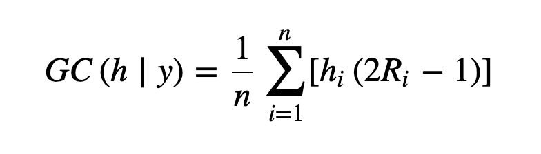

- **Title: CONCENTRATION INDEX**
- Link: https://www.ncbi.nlm.nih.gov/pmc/articles/PMC4819995  O'Donnell, O., O'Neill, S., Van Ourti, T., & Walsh, B. (2016). conindex: Estimation of concentration indices. The Stata journal, 16(1), 112–138. #conindex
- **[[Concentration curve]]** #concurve
	- The concentration curve is the bivariate analogue of the Lorenz curve.
	- It plots the cumulative proportion of one variable against the cumulative proportion of the population ranked by another variable.
	- Unlike the Lorenz curve, the concentration curve may lie above the 45° line if health, or more likely a measure of ill-health, is more heavily concentrated amongst those with lower incomes.
- **[[(Standard) Concentration index]]** #conindex (ratio/fixed outcome)
	- Concentration indices measure **relative inequality** in one variable over the distribution of another.
	- The concentration index is twice the area between the [[Concentration curve]] and the 45° line indicating no relationship between the two variables.
	- 
	- where hi is the health variable in which inequality is measured.
	- The concentration index can be interpreted as a weighted mean of (health) shares with the weights depending on the fractional (income) rank (2Ri – 1).
- **[[Generalised concentration index]]** #glconindex (ratio/fixed outcome)
- Generalised concentration indices measure **absolute inequality** which is obtained by multiplication of the **[[(Standard) Concentration index]]** by the mean health.  This leads to the generalised concentration index.
- 
- **Measurement levels:** #conindex #glconindex #mconindex #econidex
	- **Fixed:** the measurement seale is unique with zero corresponding to a situation of complete absence e.g. number of visits to a hospital within a given period.
	- **Ratio:** the measurement scale is unique up to a proportional scaling factor with the zero point corresponding to a situation of complete absence e.g. life expectancy that could be measured in years, months etc.
	- **Cardinal:** the scale is such that differences between values are meaningful but ratios are not and the zero point is fixed arbitrarily e.g. temperature in Celsius or Fahrenheit, a (health) utility index.
	- **Bounded variables:** Variables with a finite upper limit, such as years in school, a (health) utility index or any-binary indicator, complicate the measurement of inequality.
- **[[Modified concentration index]]** #mconindex (cardinal outcome)
	- When the variable of interest is **cardinal**, the standard concentration index is not necessarily invariant to arbitrary retransformations of the variable.
	- 
- **[[Erreygers index]]** #econidex
	- Erreygers (2009a) proposed a modification of the generalized concentration index that corrects this deficiency:
	- 
- LATER : **21st Sep Supervision meeting - Plan for Paper 1 & Paper2**
  done:: 1630331432374
  now:: 1630331431574
  later:: 1630331434963
- **Paper1 - Systematic review of factors influencing smoking cessation behaviour of PLWH in LMICs** #paper1 #phd
	- Write PRISMA protocol
	- Revise search strings/blocks
	- Pull out preliminary records, remove duplicates
	- Identify in/exclusion criteria
	- Create PRISMA diagram
	- Timeline planning
- **Paper2 - Qualitative study of barriers and facilitators of smoking cessation perceived by PLWH in Vietnam** #paper2 #phd
	- Timeline planning
- **Predictor Variables** cannot be independent variables if they are at all correlated. #predictorvsindependentvar