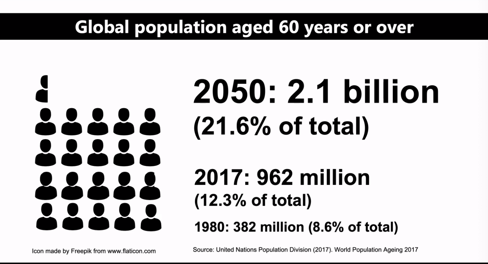
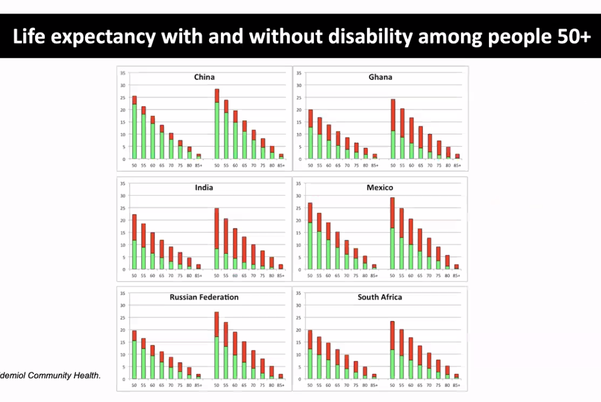
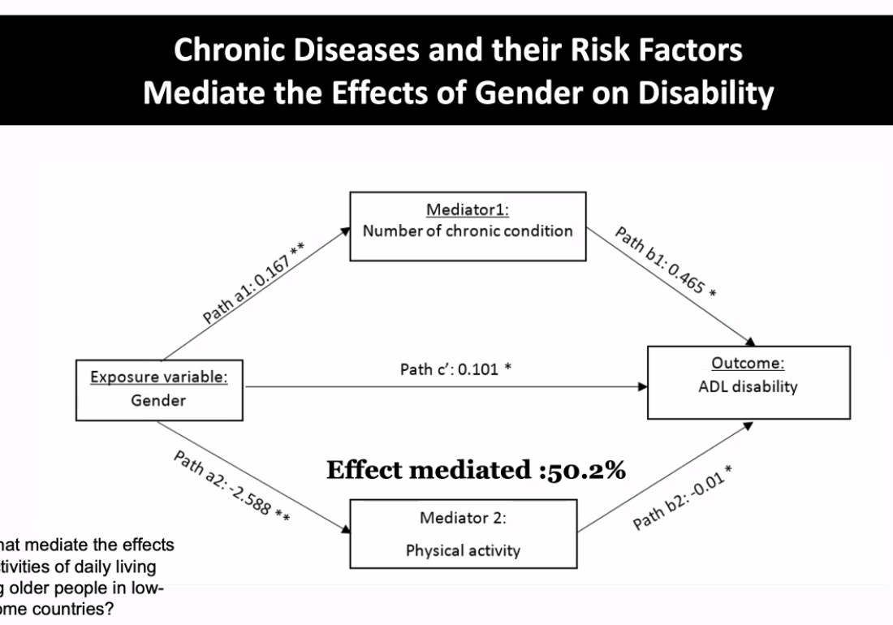
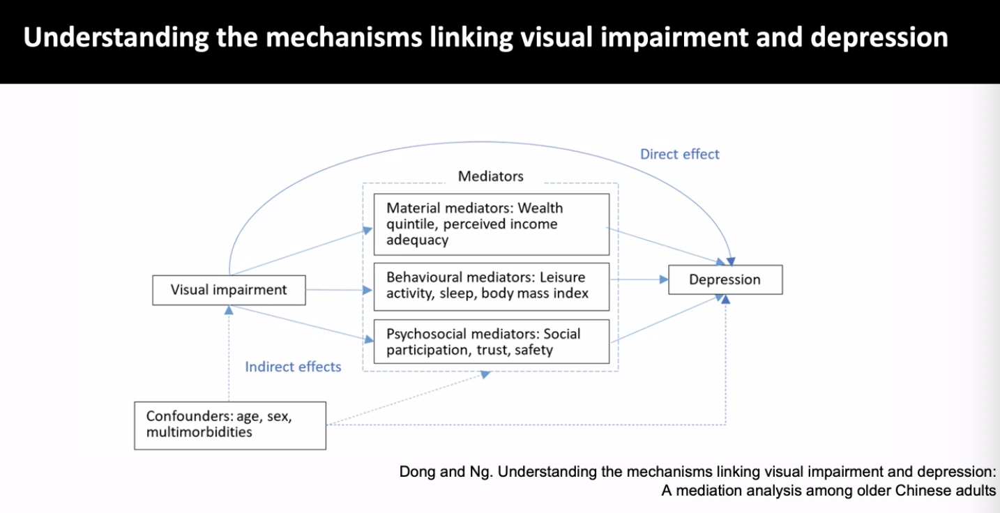

- **Nawi's lecture** #globalhealth
	- CDR > CBR = reduced Total Pop
	- Ageging pop: increased LE or reduced BR
	- 
	- HALE vs LE: "healthy" vs "long"
	- DALYs (Disability-adjusted life years) vs ADL (Activities in daily life) #DALYs #ADL
	- 
	- Why more burdens put on Indian women in terms of disabilities in India?
	- Answers:
	- 
	- Possible intervention: reduce NCDs in women, increase physical activity.
	- Another example of mediators:
	- 
	- TODO  country-differences in social capital, cognitive function... try to find possible causes? (use SAGE or SHARE)
	  todo:: 1630486345363
	- Graph8a: x-LE y-opps
	- Graph8b: LE logche
	- Graph8c: opps logche
	- Graph8d: combine %NCD: x-%NCD y-Prorp_opps
	- All by region
	- Graph J set: x-%NCD y-cata_tot_10_pop cata_tot_25_pop imp_np190_pop imp_pg_190 (latest year, put in label)
	-
	-