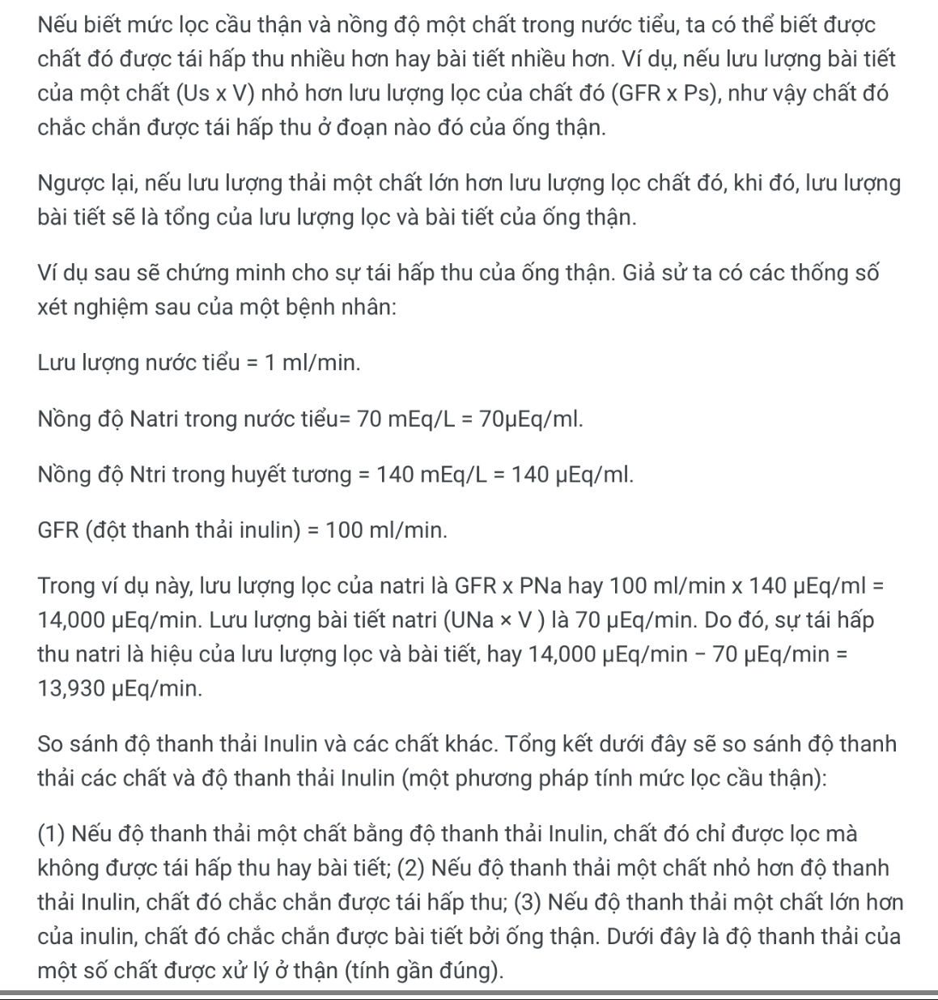
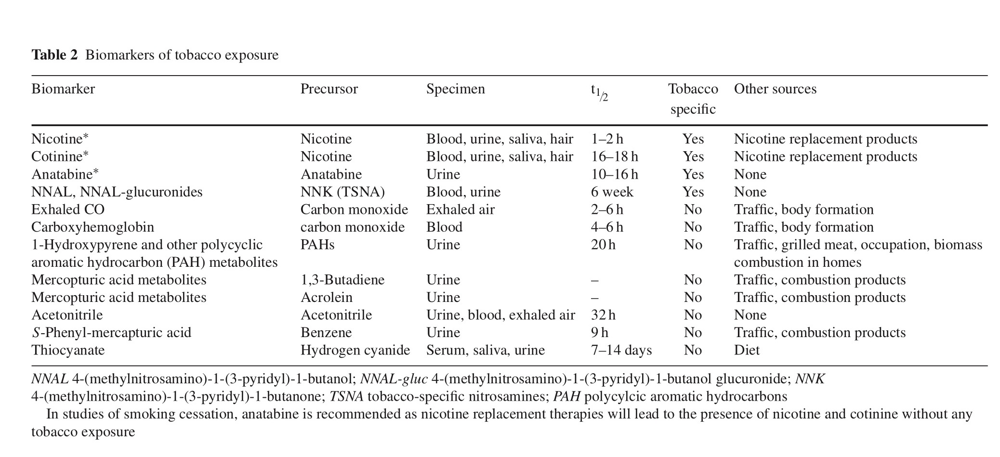

- **History of tobacco** #nicotine
	- The word tobacco was in fact a name applied in error to the plant that European explorers witnessed smoked by **Native Americans.**
	- In the mid-sixteenth century Jean Nicot, the French ambassador to Lisbon for whom nicotine was named, promoted the great healing powers of tobacco, which he claimed to cure everything from headaches to syphilis (Charlton 2004).
	- In 1587, Giles Everard published his work in Antwerp describing tobacco as a panacea and nepenthe, which became a pop- ular view of doctors throughout Europe who hailed the many curative properties of the plant (Harley 1993).
	- Despite the criticisms levied against tobacco use by James as well as doc- tors across Europe in opposition to the idea of the great catholicon from the New World, tobacco spread through Europe in the early seventeenth century and beyond.
	- Tobacco is a leading cause of death globally, responsible for one in ten deaths of among adults (5 million people annually), and the toll is expected to double over the next two decades; 70% of these deaths will be in developing countries.
	- While tobacco use is declining in developed countries, it is increasing dramatically in developing countries.
	- Furthermore, the taboos that have protected women from tobacco are falling, so that increases in the proportion of women who smoke or use smokeless tobacco may dramatically affect disease rates in the future beyond most predictions.
- **Tobacco Products**
	- Although there are “organic,” “natural,” and “additive-free” cigarettes, designed to appeal to the health conscious, there is no evidence that these are safer than regular cigarettes.
	- High taxes on manufactured cigarettes have contributed to the increased the popularity of **“roll your own” (ryo)** cigarettes in the UK and Australia. Worldwide, **cigarettes** are the most common use of tobacco.
	- **Bidis** are small, hand rolled tobacco products wrapped in a tendu or temburni leaf from India and other South East Asian countries, where they are often more popular than manufactured cigarettes. Although they contain less tobacco than factory cigarettes, they are _inhaled more intensely to maintain the ignition_, and so the delivered dose can be higher than that from a cigarette.
	- Despite this, they are increasingly popular in Western countries. For example, 40% of Massachusetts’s youth reported smoking bidis at least once.
	- **Cheroots** are rolls made from tobacco leaves, while **chuttas** are a type of cheroot made at home or in cottage industry; 9% of the tobacco produced in India is used to make chuttas. Chutta smoking is popular in Andhra Pradesh, Tamil Nadu, and Orissa.
	- **Dhumti** is made by rolling a tobacco leaf in the leaf of another plant, forming a conical, cigar-like stick. These are more popular than factory cigarettes in Goa.
	- **Kreteks**, or clove cigarettes, typically contain 40% cloves and 60% tobacco, although the ratio varies. These are the most popular form of combusted tobacco use in Indonesia (c. 90%); where over 100 million sticks are manufactured daily.
	- **Waterpipe**: The great physician Abul Fath suggested that smoke “should be passed through a small receptacle of water so that it would be rendered harmless.” Tobacco is heated in the “head” of a waterpipe, often using coals or charcoal to heat the tobacco; the smoke passes through water and is inhaled through a tube; the waterpipe may be shared with others, and the act of smoking waterpipes is mostly a social one, either in cafes or with friends or family. However, high levels of toxic chemicals can be inhaled from waterpipe smoking.
- Tobacco use in the United States has changed dramatically over the past century (Fig. 7). In the early part of the twentieth century two factors contributed to a steep rise in the use of cigarettes: the invention of the automatic cigarette rolling machine, and the provision of free cigarettes to soldiers serving in the military, especially dur- ing both World Wars.
- Tobacco kills a third to a half of the people who use it. In India, about a quarter of the deaths among middle aged men are caused by smoking.
- While many countries in the developed world (notably the USA, Canada, Australia, and the UK) have made significant progress in reducing smoking, tobacco use is increasing rapidly in the developing world, seen as an open market by tobacco companies.
- **Nicotine and related alkaloids in Tobacco Products**  #nicotine
	- Nicotine (Fig. 1) is a natural ingredient acting as a botanical insecticide in tobacco leaves. It is the principal tobacco alkaloid, occurring to the extent of about…
	- Oral snuff and pipe tobacco contain concentrations of nicotine similar to cigarette tobacco, whereas cigar and chewing tobacco have only about half the nicotine concentration of cigarette tobacco, and on average about 1–1.5 mg of nicotine is absorbed systemically during smoking (Benowitz and Jacob 1984).
- **Absorption of Nicotine**  #nicotine
	- The process of cigarette smoking is complex and, as mentioned above, the smoker can manipulate the dose of nicotine and nicotine brain levels on a puff- by-puff basis.
	- Intake of nicotine during smoking depends on **puff volume**, **depth of inhalation,** **the extent of dilution with room air**, and** the rate and intensity of puffing** (USDHHS 2001). For this reason, machine-determined nicotine yields of cigarettes cannot be used to estimate the dose of nicotine by a smoker (Jarvis et al. 2001).
	- Chewing tobacco and snuff are buffered to alkaline pH to facilitate absorption of nicotine through oral mucosa. Although absorption through cell membranes is rapid for these more alkaline tobacco products, the rise in the brain nicotine level is slower than with smoking
	- Various formulations of nicotine replacement therapy (NRT), such as nicotine gum, transdermal patch, nasal spray, inhaler, sublingual tablets, and lozenges, are buffered to alkaline pH to facilitate absorption of nicotine through cell membranes.
	- **Absorption of nicotine from all NRTs is slower and the increase in nicotine blood levels is more gradual than from smoking.**
	- Only nasal spray provides a rapid delivery of nicotine that is closer to the rate of nicotine delivery achieved with smoking (Gourlay and Benowitz 1997; Guthrie et al. 1999). The absolute dose of nicotine absorbed systemically from nicotine gum is much less than the nicotine content of the gum, in part, because considerable nicotine is swal- lowed with subsequent first-pass metabolism (Benowitz et al. 1987). Nicotine base is well absorbed through skin. That is the reason for the occu- pational risk of nicotine poisoning (green tobacco sickness) in tobacco harvesters who are exposed to wet tobacco leaves (McBride et al. 1998).
	- That is also the basis for transdermal delivery technology. Currently in the United States several different nicotine transdermal systems are marketed. All are multilayer patches.
- **Metabolism of Nicotine**  #nicotine
	- Quantitatively, the most important metabolite of nicotine in most mammalian species is the lactam derivative, cotinine. In humans, about **70–80% of nicotine is converted to cotinine**. This transformation involves two steps. The first is mediated primarily by ′ ′ CYP2A6 to produce nicotine-_1 (5 )-iminium ion, which is in equilibrium with 5′- hydroxynicotine. The second step is catalyzed by a cytoplasmic aldehyde oxidase. Nicotine iminium ion has received considerable interest since it is an alkylating agent and, as such, could play a role in the pharmacology of nicotine (Shigenaga et al. 1988).
	- Although on average about 70–80% of nicotine is metabolized via the cotinine pathway in humans, only 10–15% of nicotine absorbed by smokers appears in the urine as unchanged cotinine (Benowitz et al. 1994).
- **Factors influencing Nicotine Metabolism**  #nicotine
	- Physiological events, such as meals, posture, exercise, or drugs perturbing hepatic blood flow, are predicted to affect the rate of nicotine metabolism.
	- **Menthol** is widely used as a flavorant in foods, mouthwash, toothpaste, and cigarettes. A moderate inhibition of CYP2A6-mediated nicotine metabolism in human liver microsomes by menthol and various related compounds has been reported (MacDougall et al. 2003). This is supported by a crossover study in people, showing that mentholated cigarette smoking significantly inhibits metabolism of nicotine to cotinine and nicotine glucuronidation when compared to smoking nonmentholated cigarettes (Benowitz et al. 2004).
	- **Grapefruit** juice inhibits CYP2A6, as evidenced by inhibition of coumarin metabolism in people (Runkel et al. 1997). Grapefruit juice has been shown to inhibit the metabolism of nicotine to cotinine in nonsmokers who were given nico- tine orally, with evidence of a greater effect with larger doses of grapefruit juice (Hukkanen et al. 2006). Grapefruit juice also increased renal clearance of nicotine and cotinine by an unknown mechanism.
	- Grapefruit juice had no signficant effect on overall exposure to nicotine (area under the plasma concentration–time curve) because the effects of slowed metabolism were offset by the effects on in- creased renal clearance.
	- **Age** - Clearance of nicotine is decreased in the elderly (age >65) compared to adults (Molander et al. 2001). Total clearance was lower by 23%, and renal clearance lower by 49% in the elderly compared to young adults.
	- Neonates have diminished nicotine metabolism, as demonstrated by a nicotine half-life of three to four times longer in newborns exposed to tobacco smoke than in adults (Dempsey et al. 2000).
	- Cotinine half-life is reported to be similar in neonates, older children, and adults in two studies (Dempsey et al. 2000; Leong et al. 1998).
	- Other studies found that the half-life of urine cotinine was about three times longer in children less than one year old than to the cotinine half-life in adults (Collier et al. 1994).
	- Why nicotine has a much longer half-life in **neonates** than in adults, whereas the cotinine half-life is essentially the same in newborns and adults, might par- tially be explained by differing sensitivities of nicotine and cotinine clearances to changes in hepatic blood flow. Another explanation could be that nicotine and cotinine are metabolized mainly by enzymes other than CYP2A6 in neonates. However, neonates have only slightly lower amounts of CYP2A6, CYP2D6, and CYP2E1 protein in liver micro- somes, whereas the CYP2B6 amount is clearly diminished in neonates compared to adults and older children (Tateishi et al. 1997).
	- During **sleep**, hepatic blood flow declines and nicotine clearance falls correspondingly. Thus, the day/night variation and meal effects of nicotine clearance result in circadian variations in plasma concentrations during constant dosing of nicotine (Gries et al.)
	- Differences between **Men and Women**: A twin study with intravenous infusions of both nicotine and cotinine clearly shows that nicotine and cotinine clearances are higher in women than in men; oral contra- ceptive use further accelerates nicotine and cotinine clearances in women (Benowitz et al. 2006)
	- **Pregnancy**: Clearance is increased by 60 and 140% for nicotine and cotinine, respec- tively, in pregnancy compared to postpartum (Dempsey et al. 2002).
	- **Menstrual cycle** (follicular phase vs. luteal phase) has no effect on nicotine and cotinine phar- macokinetics in healthy nonsmoking women (Hukkanen et al. 2005b).
	- **Kidney failure** not only decreases renal clearance of nicotine and cotinine, but also metabolic clearance of nicotine (Molander et al. 2000).
	- A few **drugs** have been shown to induce CYP2A6 in human primary hepatocyte culture. These include prototypical inducers rifampicin, dexamethasone, and phe- nobarbital, although there is wide interindividual variability in response (Madan et al. 2003; Meunier et al. 2000; Rae et al. 2001).
	- Several **compounds** are inhibitors of CYP2A6-mediated nicotine metabolism in vitro, including methoxsalen (8-methoxypsoralen), tranylcypromine, tryptamine and coumarin (Le Gal et al. 2003; MacDougall et al. 2003; Nakajima et al. 1996; Zhang et al. 2001).
	- **Cigarette smoking** itself influences the rate of metabolism of nicotine. Cigarette smoking is known to accelerate the metabolism of some drugs, especially the ones primarily metabolized by CYP1A2 (Zevin and Benowitz 1999).
	- However, we found that the clearance of nicotine was significantly slower in cigarette smokers than in nonsmokers (Benowitz and Jacob 1993). These studies suggest that there are substance(s) in tobacco smoke, as yet unidentified, that inhibit the metabolism of nicotine.
	- In a study in which nonsmokers received an intravenous infusion of nicotine with and without pretreat- ment with high doses of cotinine, there was no effect of cotinine on the clearance of nicotine (Zevin et al. 1997).
	- Tyndale and coworkers have demonstrated that administration of nicotine for 21 days to monkeys in vivo decreases CYP2A6 activity (nicotine metabolism) by downregulating CYP2A6 mRNA and protein in liver (Schoedel et al. 2003). Interestingly, expression of both CYP2A and CYP3A5 mRNAs are markedly reduced in human pulmonary tissues in smokers compared to nonsmokers (Crawford et al. 1998; Hukkanen et al. 2003).
	- **Racial and ethnic differences:** We compared nicotine and cotinine metabolism in blacks and whites (Benowitz et al. 1999; Perez-Stable et al. 1998). The total and nonrenal clearance of co- tinine was significantly **lower in blacks than in whites** (total clearance 0.57 vs. 0.76 ml min −1kg −1).
	- Also, the fractional clearance of nicotine to cotinine, and the metabolic clearance of nicotine to cotinine were lower in blacks.
	- The clearance of nicotine tended to be lower in blacks than in whites (18.1 vs. 20.5 ml min −1kg −1), but this difference was not significant.
	- Slower metabolism of cotinine explains in part the higher cotinine levels per cigarette detected in blacks than in whites (Caraballo et al. 1998; English et al. 1994; Wagenknecht et al. 1990).
	- One possible explanation for the slower cotinine metabolism in blacks is the significantly higher proportion of menthol cigarette smokers in blacks than in whites (69% vs. 22% in the general US population, 76% vs. 9% in our study) (Benowitz et al. 1999; Giovino et al. 2004).
	- Chinese–Americans had the lowest total and nonrenal clearance of nicotine and cotinine, and lowest metabolic clearance of nicotine via the cotinine pathway.
	- Also, nicotine intake per cigarette was lower in Chinese–Americans than in Latinos and whites.
	- No significant differences in nicotine and cotinine metabolism or nicotine intake were detected between Latinos and whites.
- **Ranel excretion**  #nicotine
	- Renal excretion of cotinine is a minor route of elimination, averaging **about 12% of total clearance.**
	- The genetic contributions to nicotine and cotinine renal clearances have been estimated in a twin study (Benowitz et al. 2008b). This study found a substantial contribution of **genetic factors to the net secretory/reabsorbtive clearances of nicotine and cotinine.** These findings suggest either that the reabsorption of nicotine and cotinine are active processes and are influenced by the genetics of reabsorptive transporters, or that the active secetory component of renal clearance exerts a substantial effect on the clearance, even in the presence of net reabsorption.
	- **Blood levels peak at the end of smoking a cigarette and decline rapidly over the next 20 min due to tissue distribution.**
	- Although the rate of **rise of nicotine is slower for cigar smokers and users of snuff and chewing tobacco than for cigarette smokers, peak venous blood levels of nicotine are similar** (Benowitz et al. 1988).
	- Pipe smokers, particularly those who have previously smoked cigarettes, may have blood and urine levels of nicotine and cotinine as high as cigarette smokers (McCusker et al. 1982; Wald et al. 1981).
	- Likewise, **cigar smokers who have previously smoked cigarettes may inhale more deeply and achieve higher blood levels of nicotine than primary cigar smokers,** although on average, based on urinary cotinine levels, daily nicotine intake appears to be less for cigar smokers compared with cigarette or pipe smokers (Wald et al. 1984).
- 
- **Biomarkers of Nicotine Exposure** #biomarker
	- Biomarkers are desirable for quantifying the systemic exposure of smokers to toxic constituents of smoke derived from tobacco use or from potential reduced harm products.
	- Measures such as cigarettes per day are imprecise indicators of tobacco smoke exposure because of variability in how smokers smoke their cigarettes.
	- There is considerable individual variability in smoke intake, even by people smoking the same brand of cigarettes (USDHHS 2001).
	- Cigarette design and how the cigarette is smoked influence toxic exposures. For example, light cigarettes are smoked on average more intensely than are regular cigarettes.
	- The optimal assessment of exposure to tobacco smoke would be the analysis of concentrations of chemicals of pathogenetic concern in body fluids of the exposed individual – termed a biological marker or biomarker.
	- Because of the long half-life of **cotinine**, it has been used as a biomarker for daily intake, both in cigarette smokers and in those exposed to secondhand tobacco smoke (Benowitz 1996).
	- There is, however, individual variability in the quantitative relationship between steady state cotinine levels and intake of nicotine. This is because different people convert different percentages of nicotine to cotinine (usual range 50–90%), and because different people metabolize cotinine differently at different rates (usual clearance range 20–75 ml min −1) (Benowitz 1996).
	- The use of **hair** as a material in which to measure nicotine and cotinine has been proposed as a way to assess long-term exposure to nicotine from tobacco products. Nicotine and cotinine are incorporated into hair as it grows over time. The average rate of hair growth is 1 cm per month.
	- Potentials problems with the use of hair include a strong influence of hair pigmentation on nicotine and cotinine binding and uptake (Dehn et al. 2001). Nicotine and cotinine are bound to melanin. As a result, dark hair binds much more nicotine than does blond or white hair. This makes comparison across individuals difficult. Also, hair is exposed to nicotine and cotinine from sweat and from sebaceous gland secretions, and to nicotine from environmental tobacco smoke exposure. Washing the hair before analysis may reduce this problem of environmental contamination, but it is not likely to remove all environmental nicotine and cotinine…
	- **Toenail clippings** are easy to collect and store and repre- sent cumulative exposure as nails grow at a rate of about 0.1 cm per month. In a group of smokers, the average toenail biomarker concentrations were 5.4 ng nico- tine and 0.67 ng cotinine per mg toenail. Plasma levels of nicotine and cotinine were significantly but moderately correlated with toenail levels.
	- **Dietary sources** of nicotine have been alleged to be a potential confounder of cotinine levels used in measurement of secondhand smoke exposure. Several foods contain small amounts of nicotine (Siegmund et al. 1999). However, the levels of nicotine in foods are quite low.
	- 
- **Cut-off point to distinguish tobacco use vs non-tobacco use** #cutoff #nicotine
	- In the United Kingdom in the early 1980s, an optimal plasma or saliva cotinine cut-point of 15 ng/ml−1 or a urine cotinine of 50 ng/ml−1 were determined to discriminate smokers from nonsmokers (some of whom are exposed to secondhand smoke) (Benowitz et al. 2002a)
	- Using receiver operator characteristic curve analysis, the optimal cotinine cut-points were **3.08 ng/ml−1** for adults (sensitivity 96.3%, specificity 97.4%) and **2.99 ng/ml−1** for adolescents (sensitivity 86.5%, specificity 93.1%).
	- The decline in the optimal cut-point since 1980 is likely due to the marked reduction in secondhand smoke exposure in the general US population.
	- Of note is that the cut-points are much lower for Mexican Americans than for whites or African Americans, most likely due to both more occasional smoking and lower exposure to secondhand smoke.