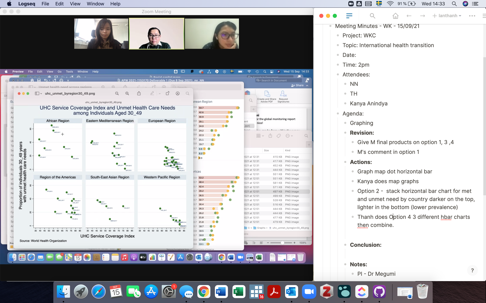
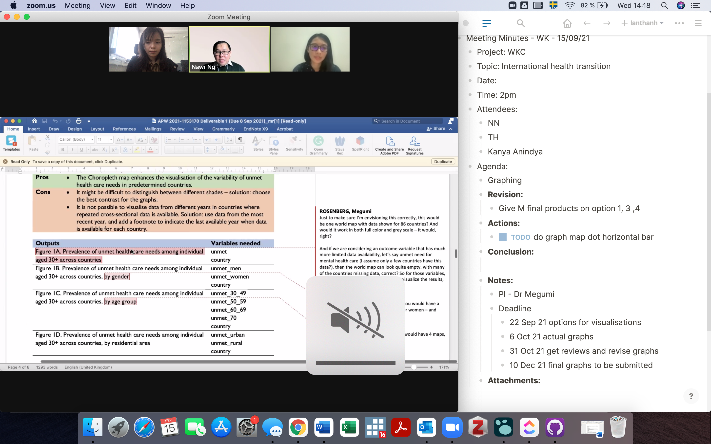
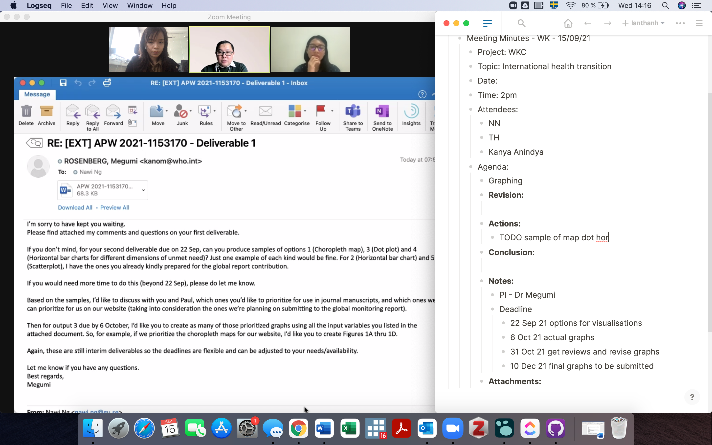

- **Data & Do-file**
	-
- **Products**
	- Deliverable 1
		- [APW 2021-1153170 Deliverable 1 (Due 8 Sep 2021).docx](../assets/APW_202021-1153170_20Deliverable_201_20(Due_208_20Sep_202021)_1631710851746_0.docx)
- **Meetings** [Zoom ](https://gu- se.zoom.us/j/68182965770#success)
	- Meeting Minutes - WK - [[Sep 15th, 2021]]
		- Project: WKC
		- Topic: International health transition
		- Date: [[Sep 15th, 2021]]
		- Time: 2pm
		- Attendees:
			- NN
			- TH
			- Kanya Anindya
		- Agenda:
			- Graphing
			- **Revision:**
				- Give M final products on option 1, 3 ,4
				- M's comment in option 1 - see attachment
			- **Actions:**
				- Graph map dot horizontal bar
				- Kanya does map graphs
				- Option 2 -  stack horizontal bar chart for met and unmet need by country darker on the top, lighter in the bottom (lower prevalence)
				- TODO Thanh does Option 4
					- 3 different hbar charts then combine
					- if the data does not reach 100%, plot only met/unmet)
					- unmet red met green
			- **Conclusion:**
				-
			- **Notes:**
				- PI - Dr Megumi
				- Deadline
					- 22 Sep 21 options for visualisations
					- 6 Oct 21 actual graphs
					- 31 Oct 21 get reviews and revise graphs
					- 10 Dec 21 final graphs to be submitted
				- Another report of Paul than ADB and WKC
				- Some countries have missing data
			- **Attachments:**
				- 
				- 
				- {:height 230, :width 355}